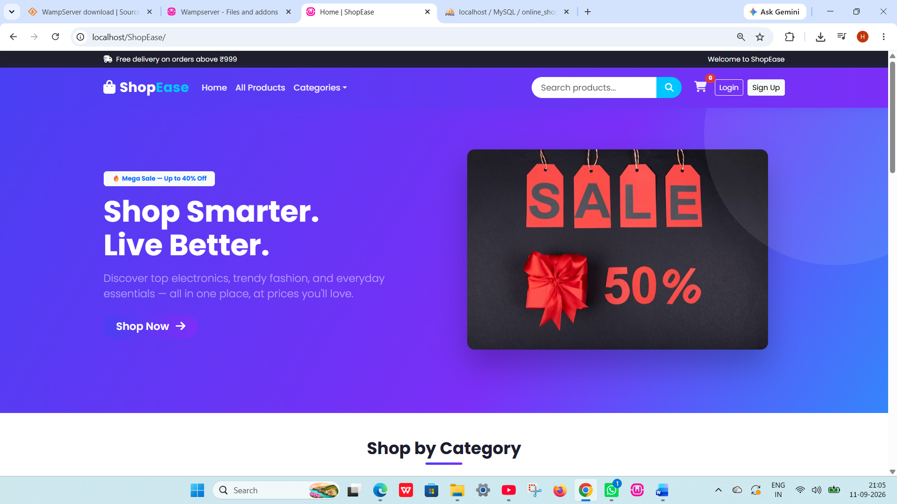
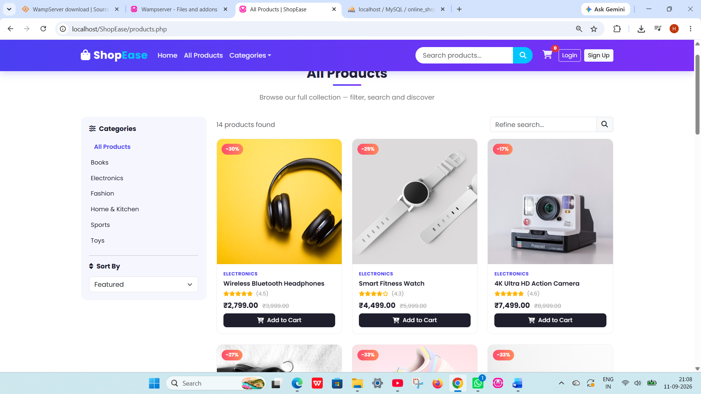
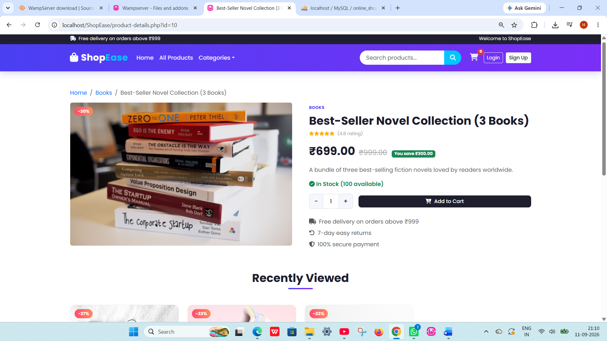
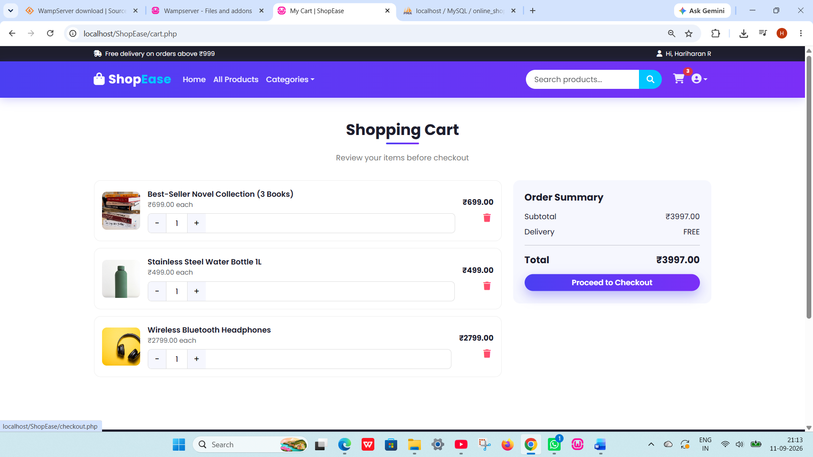
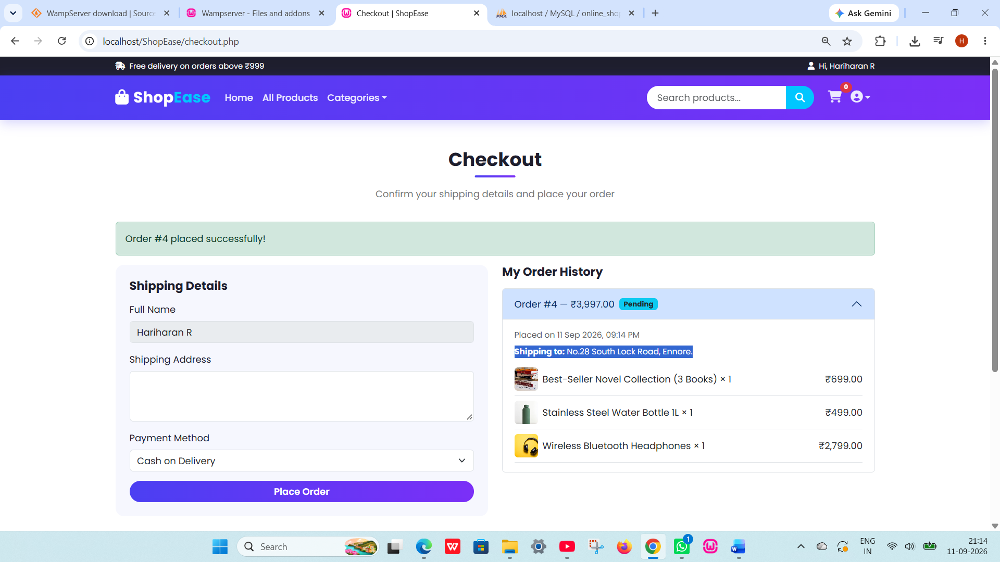

# 🛍️ ShopEase — Online Shopping System

A full-stack Online Shopping System built with **PHP, MySQL, Bootstrap 5, JavaScript, jQuery and AJAX**. ShopEase covers the complete e-commerce workflow — browsing, searching, cart management, authentication, and checkout — with a responsive, modern UI and zero page reloads for cart or product-filtering actions.


---

## ✨ Features

- 🏠 Responsive, animated home page with hero banner and category shortcuts
- 🛒 Product listing with category filters, sorting, and live search — all via AJAX
- 🔍 Product details page with ratings, discounts, related products, and a cookie-based "recently viewed" strip
- 🧺 Fully working shopping cart — add, remove, and update quantities with real-time totals (no page reloads)
- 👤 Customer registration and login with hashed passwords
- 🔐 PHP Sessions for auth state, Cookies for "remember me" and recently-viewed tracking
- 📝 Server-side file handling — logs searches, views, logins, and orders to a text file
- 📦 Checkout flow with order placement and order history
- 🎨 CSS3 transitions, transforms, and keyframe animations throughout
- 📱 Fully responsive Bootstrap 5 layout, including a mobile-friendly navbar and grid

---

## 🧰 Tech Stack

| Layer | Technology |
|---|---|
| Markup / Styling | HTML5, CSS3, Bootstrap 5 |
| Client-side scripting | JavaScript (ES6), jQuery |
| Data loading | AJAX (`$.ajax`) |
| Server-side | PHP |
| Database | MySQL / phpMyAdmin |
| State management | PHP Sessions, Cookies |
| Persistence (logs) | PHP File Handling |
| Local environment | WAMP (Apache + MySQL + PHP) |

---

## 📸 Screenshots

> Add your own screenshots to a `/screenshots` folder in the repo and they'll render below.

| Home Page | Product Listing | Product Details |
|---|---|---|
|  |  |  |

| Shopping Cart | Checkout | Mobile View |
|---|---|---|
|  |  |  |

---

## 🗂️ Project Structure

```
ShopEase/
├── index.php                 # Home page
├── products.php               # Product listing (category filter + search)
├── product-details.php        # Single product view
├── cart.php                   # Shopping cart page
├── register.php               # Customer registration
├── login.php                  # Customer login
├── logout.php                 # Session logout
├── checkout.php                # Checkout + order history
├── database.sql               # Full schema + seed data (phpMyAdmin-ready)
├── config/
│   └── database.php           # MySQLi connection
├── includes/
│   ├── header.php             # Shared navbar/header
│   ├── footer.php             # Shared footer
│   ├── auth.php               # Session/cookie/file-logging helpers
│   └── product_card.php       # Reusable product card partial
├── ajax/
│   ├── products.php           # AJAX product filtering/search endpoint
│   └── cart.php               # AJAX cart add/update/remove endpoint
├── css/
│   └── style.css              # Theme, animations, responsive layout
├── js/
│   ├── app.js                 # Product class, AJAX product loading, UI effects
│   └── cart.js                # Cart rendering, quantity controls, totals
├── images/                    # Product & UI images
└── data/
    └── recent_views.txt       # Activity log (searches, views, logins, orders)
```

---

## ⚙️ Setup & Installation (WAMP)

1. **Install [WAMP Server](https://www.wampserver.com/)** and start it — wait for the tray icon to turn green.
2. **Copy this project** into `C:\wamp64\www\ShopEase` so that `C:\wamp64\www\ShopEase\index.php` exists.
3. Open **`http://localhost/phpmyadmin`**, click **Import**, select `database.sql` from the project folder, and click **Go**.
   This creates the `online_shopping` database, all five tables, and seeds 14 sample products plus a test customer account.
4. Visit **`http://localhost/ShopEase/`** in your browser.

### Test Login
```
Email:    test@shopease.com
Password: password123
```

---

## 🗄️ Database Schema

| Table | Purpose |
|---|---|
| `customers` | Registered customer accounts (hashed passwords) |
| `products` | Product catalogue — price, discount, category, rating, stock |
| `cart` | Cart items, linked by session (guests) or customer_id (logged in) |
| `orders` | Placed orders — total, status, shipping address |
| `order_items` | Line items belonging to each order |

Full column definitions are in [`database.sql`](database.sql).

---

## 🚀 Key Implementation Notes

- **AJAX everywhere it matters** — product filtering/search and all cart operations (`ajax/products.php`, `ajax/cart.php`) return JSON/HTML fragments, so the UI updates instantly without a full page reload.
- **Guest-friendly cart** — cart rows are keyed by a stable per-browser session ID, so a visitor can add items before creating an account; the cart automatically links to their account on login.
- **Security basics** — passwords are hashed with `password_hash()`/`password_verify()`, and all SQL uses either prepared statements or escaped input.

---

## 📄 License

This project is open-source and free to use for learning purposes.

---

## 🙋 Author

Built by Hariharan R — feel free to connect on [LinkedIn](#) or check out more projects on [GitHub](#).
